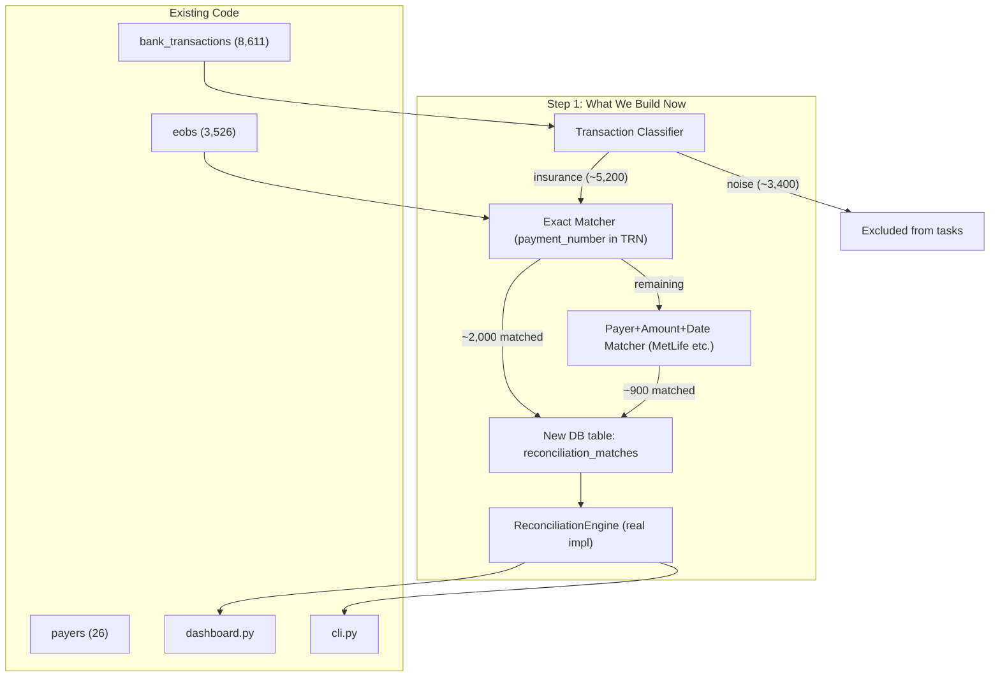

# Step 1: Foundation -- Schema, Classifier, and Exact Matcher

The goal is to get a **working end-to-end engine** as fast as possible, starting with the highest-value, lowest-risk pieces. We can iterate from there.

## Architecture




## 1. Add `reconciliation_matches` table

Add a new Peewee model in [bank_reconciliation/db/models.py](bank_reconciliation/db/models.py) to persist match results. This avoids recomputing matches on every API call and is good system design (the interview cares about this).

```python
class ReconciliationMatch(BaseModel):
    eob = ForeignKeyField(EOB, unique=True)
    bank_transaction = ForeignKeyField(BankTransaction, null=True)
    confidence = FloatField()          # 0.0-1.0
    match_method = CharField()         # "payment_number", "payer_amount_date", etc.
    matched_at = DateTimeField()

    class Meta:
        table_name = "reconciliation_matches"
```

Also add a boolean/flag column or a separate table to mark bank transactions as `is_insurance` (from the classifier). Could be a column on `BankTransaction` or a separate `transaction_classifications` table.

## 2. Transaction Classifier

Create [bank_reconciliation/reconciliation/classifier.py](bank_reconciliation/reconciliation/classifier.py) -- a function that labels each bank transaction as insurance vs. noise.

**Positive signals (insurance)**:

- Note contains `HCCLAIMPMT` (3,736 txns)
- Note is exactly `MetLife` (1,488 txns)
- Note contains `CALIFORNIA DENTA` (12 txns)
- Note contains `Guardian Life` (2 txns)
- Note matches `REMOTE DEPOSIT CAPTURE` with negative amount (potential check deposits -- 134 txns)

**Negative signals (noise)** -- exclude from "Missing EOB" tasks:

- `PAYROLL`, `rent`, `LOAN`, `SERVICE CHARGE`, `BNKCD SETTLE`, `Simplifeye`, `HARTFORD`, `PROTECTIVE LIFE`, `CHASE CREDIT`, `AMEX`, `EverBank`, `HENRY SCHEIN`, `IRS`, `GUSTO`, `Wire Out`, `KAISER`, `FeeTransfer`, `Electronic Payment`, `ADMIN NETWORKS`, `DENTU-TEMPS`, `ANTONOV`, `KIMBERLY`, `TDIC`, `DMV`, etc.

This should be a **rule-based classifier** (not ML) using pattern matching on the `note` field. Keep it as a list of patterns so it's easy to extend for the 4-year dataset.

## 3. Exact Matcher -- Payment Number in TRN

Create [bank_reconciliation/reconciliation/matchers.py](bank_reconciliation/reconciliation/matchers.py) (or a `matchers/` directory).

**Matcher 1: `PaymentNumberMatcher`**

- For HCCLAIMPMT transactions, extract the payment number from the TRN pattern: `TRN*1*<PAYMENT_NUMBER>*`
- Look up the EOB with that `payment_number`
- Verify amount: `ABS(bt.amount) == eob.adjusted_amount` (or within small tolerance)
- Confidence: **1.0** if amount matches, **0.9** if amount is close (fee tolerance)
- This covers ~2,000 matches with near-zero false positives

**Matcher 2: `PayerAmountDateMatcher`**

- For transactions where payer name is in the note (MetLife, California Dental, Guardian)
- Match on: payer name + `ABS(amount) == adjusted_amount` + date within 5-day window
- If unique match: confidence **0.85**
- If multiple candidates: pick closest date, confidence **0.7**, or flag as ambiguous

## 4. Implement `ReconciliationEngine`

Create [bank_reconciliation/reconciliation/engine.py](bank_reconciliation/reconciliation/engine.py) subclassing `ReconciliationEngine` from `base.py`.

- On init (or via a `run_matching()` method), execute the classifier + matchers and write results to `reconciliation_matches`
- `get_dashboard_payments`: JOIN `eobs` and `bank_transactions` through `reconciliation_matches`, UNION with unmatched EOBs and unmatched insurance transactions. Paginate, order by date DESC.
- `get_missing_bank_transactions`: Query EOBs not in `reconciliation_matches`, excluding `NON_PAYMENT` with `adjusted_amount == 0`. Order by date DESC.
- `get_missing_payment_eobs`: Query insurance-classified transactions not in `reconciliation_matches`. Order by date DESC.

## 5. Wire it up

Replace `DummyReconciliationEngine()` with the real engine in:

- [bank_reconciliation/dashboard.py](bank_reconciliation/dashboard.py) line 17
- [bank_reconciliation/cli.py](bank_reconciliation/cli.py) line 162

## Files to create/modify


| Action | File                                                                                                 |
| ------ | ---------------------------------------------------------------------------------------------------- |
| Modify | `bank_reconciliation/db/models.py` -- add `ReconciliationMatch` + `TransactionClassification` models |
| Modify | `bank_reconciliation/db/init_db.py` -- add new tables to `create_tables`                             |
| Create | `bank_reconciliation/reconciliation/classifier.py` -- transaction classifier                         |
| Create | `bank_reconciliation/reconciliation/matchers.py` -- matching logic                                   |
| Create | `bank_reconciliation/reconciliation/engine.py` -- real `ReconciliationEngine` impl                   |
| Modify | `bank_reconciliation/reconciliation/__init__.py` -- export new engine                                |
| Modify | `bank_reconciliation/dashboard.py` -- swap dummy for real engine                                     |
| Modify | `bank_reconciliation/cli.py` -- swap dummy for real engine                                           |


## What this gets us

After this step, we'll have a **fully functional engine** that:

- Auto-matches ~2,900 EOB/transaction pairs (payment number + payer name matches)
- Correctly filters noise from "Missing EOB" tasks
- Excludes zero-dollar NON_PAYMENTs from "Missing Transaction" tasks
- Persists results for fast queries
- Has clean separation: classifier, matchers, engine

## What comes next (Step 2, not now)

- Fuzzy/amount-only matching for remaining unmatched items
- Batch deposit detection
- Time-threshold logic for task surfacing (don't flag recent items)
- Tests

