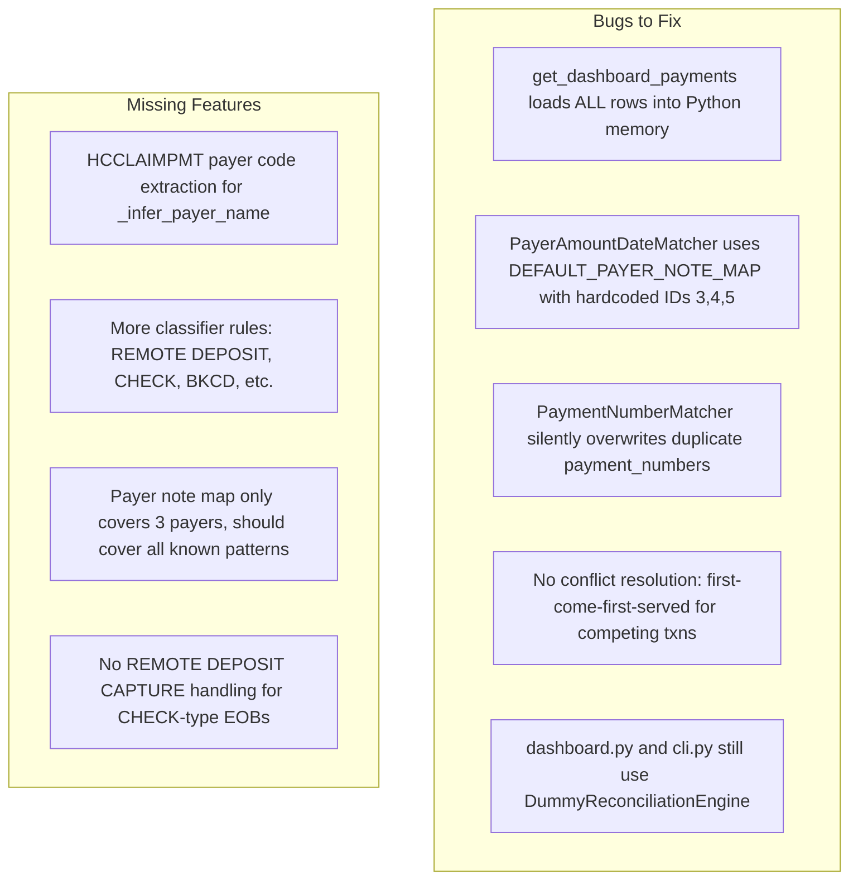

# Improve Engine, Matchers, and Wire Everything Up

## Current State

What exists and works:

- `classifier.py` -- rule-based + LLM fallback, tested (59 tests)
- `matchers.py` -- `PaymentNumberMatcher` + `PayerAmountDateMatcher` + `match_all()` orchestrator, tested (31 tests)
- `engine.py` -- `LiveReconciliationEngine` with `run_matching()` and all 3 interface methods, tested (20 tests)
- DB models -- `TransactionClassification` + `ReconciliationMatch` tables

What is broken or missing:




## Changes by File

### 1. Fix `engine.py` -- Performance and Correctness

**Problem**: `get_dashboard_payments()` loads ALL matched pairs, ALL unmatched EOBs, and ALL unmatched insurance transactions into a Python list, sorts in memory, then slices for pagination. With 8,611 transactions and 3,526 EOBs this is ~12K objects in memory on every page request.

**Fix**: Use SQL `UNION ALL` with `ORDER BY` and `LIMIT/OFFSET` pushed to the database. Build three subqueries (matched, unmatched EOBs, unmatched insurance txns), union them, and let SQLite handle sorting and pagination.

Alternatively, since Peewee's UNION support is limited, use a simpler approach: query each category with a count, compute which slice of which category the requested page falls into, and only fetch the needed rows. This is still much better than loading everything.

**Also fix**: The `where(EOB.id.not_in(matched_eob_ids) if matched_eob_ids else True)` pattern on line 198 is wrong -- when `matched_eob_ids` is empty, it passes `True` as the where clause, which means "no filter" but also means unmatched EOBs that ARE matched won't be excluded on the first call before any matches exist. Should use a subquery instead:

```python
matched_eob_ids_sq = ReconciliationMatch.select(ReconciliationMatch.eob)
.where(EOB.id.not_in(matched_eob_ids_sq))
```

This is already done correctly in `get_missing_bank_transactions()` and `get_missing_payment_eobs()` -- just not in `get_dashboard_payments()`.

### 2. Fix `matchers.py` -- Conflict Resolution and Payer Map

**Problem 1**: `PayerAmountDateMatcher` uses `DEFAULT_PAYER_NOTE_MAP` with hardcoded payer IDs `{3: "MetLife", 4: "Guardian Life", 5: "CALIFORNIA DENTA"}`. These IDs are specific to the current DB. The engine already calls `PayerAmountDateMatcher(eobs, payer_note_map=None)` which falls back to these hardcoded IDs. Should use `build_payer_note_map_from_db()` instead, and that function should be expanded.

**Fix**: In `engine.py` `run_matching()`, call `build_payer_note_map_from_db(list(Payer.select()))` and pass the result. Expand `build_payer_note_map_from_db` to cover more payers:

```python
_KNOWN = {
    "MetLife": "MetLife",
    "Guardian": "Guardian Life",
    "Delta Dental": "CALIFORNIA DENTA",  # for the positive CA transactions
}
```

**Problem 2**: `PaymentNumberMatcher.__init__` silently overwrites if two EOBs share a `payment_number` (line 89). Add a warning log or store a list.

**Problem 3**: No global conflict resolution. Two transactions can compete for the same EOB across matchers. Currently first-iteration-order wins. For the take-home scope, this is acceptable but should be documented as a known limitation with a comment explaining the trade-off.

### 3. Expand `_infer_payer_name` in `engine.py`

Currently only matches 4 patterns. Should also extract payer from HCCLAIMPMT codes:

```python
_HCCLAIMPMT_PAYER_CODES = {
    "UHCDComm": "UnitedHealthcare",
    "PAY PLUS": "Anthem/Cigna",
    "DELTADENTALCA": "Delta Dental",
    "DELTADNTLINS": "Delta Dental",
    "DELTADIC-FEDVIP": "Delta Dental",
    "HUMANA": "Humana",
    "GEHA": "GEHA",
    "CIGNA": "Cigna",
    "ANTHEM": "Anthem",
    "UMR": "UMR",
    "DDPAR": "Delta Dental",
    "DENTEGRA": "Ameritas/Dentegra",
    "HNB - ECHO": None,  # clearinghouse, can't determine payer
    "PNC-ECHO": None,
}
```

### 4. Wire up `dashboard.py` and `cli.py`

Replace `DummyReconciliationEngine()` with `LiveReconciliationEngine()` in both files.

In [dashboard.py](bank_reconciliation/dashboard.py) line 17:

```python
# from .reconciliation.dummy_engine import DummyReconciliationEngine
from .reconciliation.engine import LiveReconciliationEngine
engine: ReconciliationEngine = LiveReconciliationEngine()
```

In [cli.py](bank_reconciliation/cli.py) line 162:

```python
engine = LiveReconciliationEngine()
```

Add a startup hook or lazy init that calls `engine.run_matching()` on first use (or on app startup for the dashboard). The dashboard should call `run_matching()` once at startup via a FastAPI `@app.on_event("startup")` handler. The CLI should call it before any list command.

### 5. Add missing classifier rules

In [classifier.py](bank_reconciliation/reconciliation/classifier.py), the `BKCD PROCESSING SETTLEMENT` pattern (11 positive transactions) is not covered. Add:

```python
_noise(r"BKCD PROCESSING", "bkcd_processing"),
_noise(r"RETURNED DEPOSIT", "returned_deposit"),
_noise(r"CHECK \d+", "check_written"),
_noise(r"Bill\.com", "billcom"),
_noise(r"Cherry", "cherry_funding"),
_noise(r"Outgoing Wire Fee", "wire_fee"),
```

### 6. Make tests pass

The tests in `test_engine.py` import `LiveReconciliationEngine` and test the full pipeline. Verify they pass after the fixes. The `test_classifies_and_matches_payer_amount_date` test (line 125) forces `payer.id = 3` to match `DEFAULT_PAYER_NOTE_MAP` -- this will break once we switch to `build_payer_note_map_from_db`. Fix the test to create a payer with name "MetLife" and let the map builder find it.

## Files to Modify


| File                                                              | Changes                                                                                                                                                   |
| ----------------------------------------------------------------- | --------------------------------------------------------------------------------------------------------------------------------------------------------- |
| [engine.py](bank_reconciliation/reconciliation/engine.py)         | Fix `get_dashboard_payments` to use subqueries instead of in-memory; expand `_infer_payer_name`; add startup matching; use `build_payer_note_map_from_db` |
| [matchers.py](bank_reconciliation/reconciliation/matchers.py)     | Expand `build_payer_note_map_from_db`; add duplicate payment_number warning; document conflict resolution trade-off                                       |
| [classifier.py](bank_reconciliation/reconciliation/classifier.py) | Add missing noise rules (BKCD, CHECK, Cherry, etc.)                                                                                                       |
| [dashboard.py](bank_reconciliation/dashboard.py)                  | Replace DummyEngine with LiveEngine; add startup hook                                                                                                     |
| [cli.py](bank_reconciliation/cli.py)                              | Replace DummyEngine with LiveEngine; call run_matching before commands                                                                                    |
| [test_engine.py](tests/unit/test_engine.py)                       | Fix payer_id=3 hardcoding in MetLife test                                                                                                                 |
| [test_classifier.py](tests/unit/test_classifier.py)               | Add tests for new noise rules                                                                                                                             |


