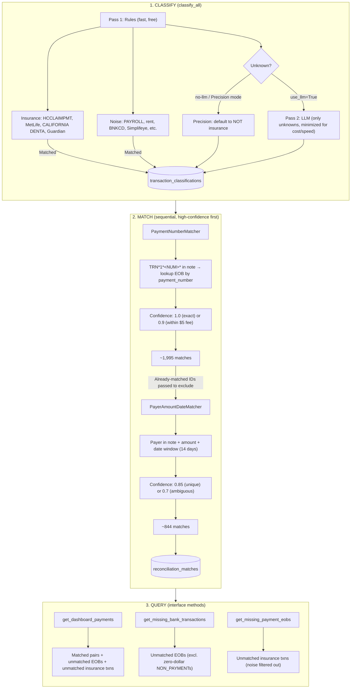

# Bank Reconciliation Project Summary 🏦

> Match bank transactions to insurance EOBs so dental practices can reconcile payments faster, with high confidence and minimal manual work.

## ✨ At a Glance

| Area | Summary |
|------|---------|
| Problem | Bank deposits and insurance EOBs arrive separately, so practices need help linking them reliably. |
| Solution | A 2-stage pipeline: first **classify** transactions as insurance vs noise, then **match** insurance transactions to EOBs. |
| Matching strategy | Try exact / near-exact `payment_number` matches first, then fall back to `payer + amount + date`. |
| Product stance | Prefer **precision over recall** so the system does not create noisy false alerts for practices. |
| Cost strategy | Use deterministic rules first and only call the LLM for unresolved edge cases. |

---

## 🔄 Pipeline Flow (`engine.run_matching()`)



### How to Read the Flow

1. **Classify** every bank transaction as insurance or not.
2. **Match** only the insurance transactions, starting with the highest-confidence method.
3. **Query** the results to power the dashboard and "missing" workflows.

---

## 📊 Key Findings

> ✅ **EOB-side matching is strong.** Most EOBs successfully find a bank transaction.

| Metric | Result | What it means |
|--------|--------|---------------|
| EOBs → bank transactions | **3,293 / 3,526 matched (~93%)** | Only ~233 EOBs remain unmatched. |
| Insurance transactions → EOBs | **2,839 / 5,238 matched (~54%)** | Many bank-side insurance transactions still need better linkage. |

> ⚠️ **Main gap:** `1,677` transactions contain TRN payment numbers in the bank note, but no EOB exists with the same `payment_number`. This points to a data alignment issue, not just a matching-code issue.

### Remaining Miss Categories

| Gap | Count | Likely cause |
|-----|-------|--------------|
| TRN present but no matching EOB `payment_number` | `1,677` | Bank and EOB systems use different identifiers or time windows. |
| Payer found, but no payer+amount EOB match | `571` | Missing/late EOBs or payer inference gaps. |
| Date window miss | `125` | Deposit timing falls outside the current tolerance. |
| Amount mismatch > $5 | `9` | Fees, formatting issues, or true mismatches. |

### Best Ways to Increase Match Rate

- **Relax constraints carefully**: a wider date window (for example `14 -> 21` days), larger amount tolerance (for example `$5 -> $10`), or adjusted confidence thresholds could recover borderline matches.
- **Expand insurance rules first**: better rule coverage is the cheapest and safest way to improve recall because it keeps more valid transactions inside the matching pipeline without increasing LLM dependence.

---

## 🧠 Insurance Classification Strategy

Before matching, each bank transaction is labeled as either **insurance** or **not insurance** (noise). Only insurance transactions move into the EOB matching pipeline and appear as potential "missing EOB" work.

> 💡 **Design principle:** keep classification cheap, fast, and trustworthy. Rules do the heavy lifting; the LLM only helps with edge cases.

### Why This Step Exists

- Matching every bank transaction to an EOB would create a lot of noise.
- Many transactions are obviously **not** insurance: payroll, rent, vendor payments, card settlement, bank fees, and similar operating activity.
- Classification acts as a gate so only likely insurance deposits flow into reconciliation.

### Two-Stage Classification Pipeline

| Stage | What happens | Why it matters |
|-------|--------------|----------------|
| **Stage 1: Rules** | Regex patterns run top-to-bottom. Insurance signals are checked first, then noise patterns. | Fast, deterministic, and covers most of the dataset. |
| **Stage 2: LLM fallback** | Only unresolved transactions are sent to `gpt-5-mini`. | Preserves recall for edge cases without paying LLM cost on common traffic. |

### What the Rules Look For

- **Insurance-positive patterns**: `HCCLAIMPMT`, `MetLife`, `Guardian`, `CALIFORNIA DENTA`, and similar payer-specific note formats.
- **Noise / non-insurance patterns**: payroll, rent, card settlement, service charges, vendor tools, and other routine business activity.
- **First match wins**: once a rule matches, the transaction is labeled immediately and never goes to the LLM.

### LLM Fallback Behavior

- Runs only for transactions that stay unknown after rules.
- Can be disabled with `--no-llm`.
- When disabled, the system falls back to mode-based handling for unknowns rather than forcing an expensive API call.

### Classification Confidence and Labels

| Outcome | Typical label | Confidence |
|---------|---------------|------------|
| Rule-matched insurance | `HCCLAIMPMT`, `MetLife`, `Guardian`, etc. | `1.0` |
| Rule-matched noise | `payroll`, `rent`, `card_settlement`, etc. | `1.0` |
| LLM says insurance | `llm_insurance` | `0.5` |
| LLM says not insurance | `llm_not_insurance` | `0.5` |
| Still unknown | `unknown` | `0.0` |

All confidence values are stored in `transaction_classifications.confidence`.

---

## 🔗 Reconciliation / Matching Strategy

Once a transaction is classified as insurance, the reconciliation engine tries to pair it with the correct EOB. The matchers run **in sequence**, from most reliable to more flexible, so the system captures the easy wins first and only uses fuzzy logic on the leftovers.

### Matcher Overview

| Matcher | Looks at | Confidence | Best for |
|---------|----------|------------|----------|
| **PaymentNumberMatcher** | `TRN` payment number + amount | `1.0` or `0.9` | HCCLAIMPMT-style notes with a direct payment reference |
| **PayerAmountDateMatcher** | payer name + amount + date window | `0.85` or `0.7` | Payers like MetLife, Guardian, and California Dental when there is no direct payment number |

### 1. PaymentNumberMatcher

This is the **high-confidence matcher**.

- It extracts the payment number from note text such as `TRN*1*<NUM>*...`.
- It looks up the EOB with that exact `payment_number`.
- It verifies the amount against `eob.adjusted_amount`.

Confidence rules:

- **`1.0`** when the bank amount matches the EOB amount exactly.
- **`0.9`** when the amount is within a small fee tolerance (`$5`).
- **No match** when the amount is too far off.

This matcher is strong because the TRN value is effectively a direct reference from the payment rail.

### 2. PayerAmountDateMatcher

This is the **fallback matcher** for insurance transactions that do not contain a usable TRN payment number.

- It infers the payer from the bank note using a configurable `payer_note_map`.
- It finds EOB candidates with the same payer and adjusted amount.
- It filters those candidates to a date window around the bank `received_at` date.
- If multiple candidates remain, it chooses the closest one in time.

Confidence rules:

- **`0.85`** when there is a unique candidate in the date window.
- **`0.7`** when multiple candidates exist and the best one is chosen heuristically.

This matcher is less precise because it relies on indirect signals rather than a direct payment identifier.

### Why the Ordering Matters

- The first matcher captures the clean, highly reliable cases.
- The second matcher only works on unmatched leftovers, which prevents duplicate matching and reduces ambiguity.
- Both matchers receive `already_matched_eob_ids` and `already_matched_txn_ids`, so each EOB and bank transaction is matched at most once.

### Match Output

Each successful reconciliation produces a record in `reconciliation_matches` with:

- `eob_id`
- `bank_transaction_id`
- `confidence`
- `match_method`

That stored output powers the dashboard, matched views, and the "missing bank transaction" / "missing EOB" workflows.

---

## ⚖️ Precision vs Recall

For transactions that remain **unknown** after rules and optional LLM classification, the system must choose whether to treat them as insurance or noise.

| Mode | Unknowns treated as | Practical effect |
|------|---------------------|------------------|
| **Precision** (default) | NOT insurance | Fewer false positives, but some real insurance may be missed. |
| **Recall** | Insurance | More true insurance found, but more noise is surfaced as fake "missing EOB" work. |

> 🎯 **Why precision wins here:** this workflow affects real money and real office operations. A false positive wastes staff time and reduces trust. A false negative is less damaging because the transaction still exists in the bank feed and can be reconciled later.

---

## 🚀 Future Improvements

### Production Architecture

- **Event-driven ingestion with delayed matching**: ingest data as it arrives, then run reconciliation after a configurable `2-4 hour` delay so the counterpart record has time to land.
- **Nightly sweep as a safety net**: retry anything still unmatched, catch late-arriving records, and generate daily summaries.
- **Multi-tenancy**: run the engine per practice with tenant-aware isolation in the DB and job queue.
- **Real task queue**: replace in-process `engine.run_matching()` with Celery + Redis, AWS SQS, or Cloud Tasks.
- **Postgres over SQLite**: needed for concurrency, row-level locking, indexing, and safer production scaling.
- **Confidence-driven automation**: auto-confirm very high-confidence matches and route medium-confidence cases for review.
- **Audit trail and compliance**: store who matched what, when, why, and with what raw data snapshot.
- **Observability and alerting**: track unmatched-rate spikes, match latency, and classifier drift over time.

### Matching and Classification

- **Expand the insurance classifier** so fewer valid transactions fall through the cracks.
- **Relax constraints selectively** with manual review where needed.
- **Fix TRN alignment issues** between bank note identifiers and EOB `payment_number`.
- **Tune the LLM fallback** for the remaining ambiguous cases while keeping usage minimal.
- **Add more payer patterns** such as Beam, GEHA, Humana, and UMR.
- **Use HCCLAIMPMT payer codes** to infer payer when TRN lookup fails.
- **Adopt payer-specific date windows** instead of one global value.
- **Use confidence thresholds** to separate auto-reconciled vs manual-review matches.
- **Consider amount-only matching with tight date bounds** as a low-confidence review path.
- **Handle duplicate `payment_number` values** more explicitly.
- **Refine `NON_PAYMENT` handling** for zero-dollar and adjustment-style EOBs.
- **Improve paper-check matching** for `REMOTE DEPOSIT CAPTURE` flows.

### Performance and Scaling

- **Batch DB writes** in groups of `500` to avoid N+1 insert behavior.
- **Use indexed matcher lookups** with in-memory maps keyed by payment number and `(payer_id, adjusted_amount)`.
- **Keep the pipeline idempotent** so reruns only process new or still-unmatched records.
- **Minimize LLM calls**: rules already resolve about `87%` of transactions for free.
- **Scale horizontally in production** because the engine itself is stateless and DB-backed.

### Generalization

- **Avoid overfitting to the sample DB**: the current data covers about `1 year`, while evaluation spans roughly `4 years`.
- **Use broad, configurable matching rules** rather than brittle dataset-specific assumptions.
- **Learn payer-specific historical behavior** over time to tune delay windows, confidence, and pattern handling.

---

## 🎥 Demo Video

A `77-second` walkthrough covers:

- The problem space
- The 2-stage pipeline
- Both matcher deep dives (`PaymentNumberMatcher` and `PayerAmountDateMatcher`)
- A live dashboard recording
- Final results

**Video path:** `video/out/demo.mp4`

To preview or re-render:

```bash
cd video
npm install              # first time only
npm run studio           # opens Remotion Studio at http://localhost:3000
npm run render           # renders to video/out/demo.mp4
npm run capture          # re-records the live dashboard (requires dashboard running at localhost:8000)
```
