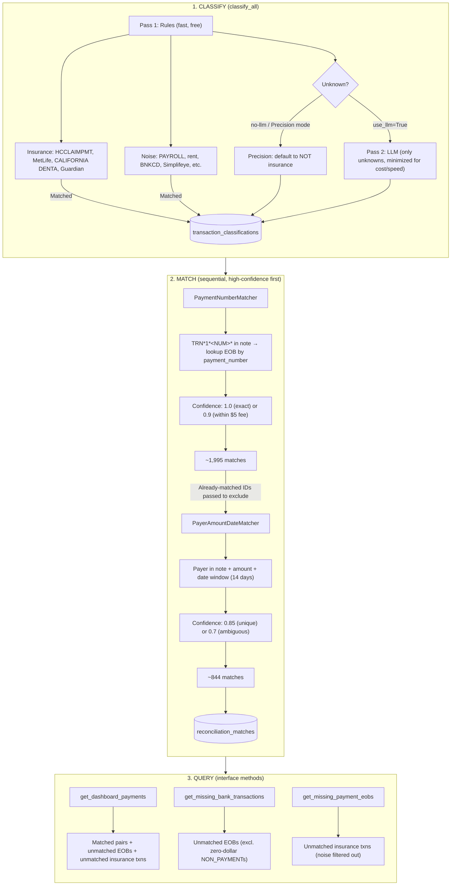

# Bank Reconciliation — Project Summary

## What It Does

Matches bank transactions to insurance EOBs (Explanation of Benefits) so dental practices can reconcile payments. Two-stage pipeline: (1) **classify** transactions as insurance or not, (2) **match** insurance transactions to EOBs via payment number or payer+amount+date.

---

## Pipeline Flow (`engine.run_matching()`)



---

## Findings (Short)

- **EOB matching accuracy is strong** — Most EOBs are matched successfully.
- **Both match rates matter:**
  - **EOBs → transactions**: 3,293 of 3,526 EOBs matched to a bank transaction (~93%); ~233 unmatched EOBs.
  - **Insurance txns → EOBs**: 2,839 of 5,238 insurance transactions matched to an EOB (~54%).
- **Main gap**: 1,677 have TRN payment numbers in notes but no EOB with that `payment_number` — bank and EOB data use different schemes or time periods. Not fixable by code.
- **Other gaps**: 571 have payer in note but no EOB for that payer+amount; 125 fail date window; 9 have amount mismatch > $5.

### Opportunities to Expand Match Rate

1. **Relax constraints** — Consider loosening date window (e.g. 14 → 21 days), amount tolerance (e.g. $5 → $10), or confidence thresholds to capture more borderline matches (with manual review where needed).
2. **Insurance classifier improvement** — Some transactions may be misclassified as NOT insurance, so they never enter the matching pipeline. Expanding rule coverage is the priority (free and fast); LLM prompts are tuned only for the remaining unknowns.

---

## Is Insurance Classification

Before matching, we classify each transaction as **insurance** or **not** (noise). Only insurance transactions are matched to EOBs and surfaced as "missing EOB" tasks.

**Design goal: minimize LLM usage.** The LLM is expensive and slow relative to rules. We use it only as a second-pass fallback — the vast majority of transactions are resolved by deterministic rules alone, keeping cost near-zero and latency low.

1. **First pass — Rules** (fast, free): Regex patterns resolve most transactions immediately. Insurance patterns (HCCLAIMPMT, MetLife, Guardian, CALIFORNIA DENTA) and noise patterns (payroll, rent, card settlement, fees, etc.) cover the bulk of the data.
2. **Second pass — LLM** (only for unknowns): Only transactions that no rule matched are sent to gpt-5-mini. This is a small fraction of the total volume. Use `--no-llm` to disable entirely and fall back to precision mode (default to NOT insurance).
- **Confidence**: Rule matches = 1.0; LLM = 0.5; unresolved unknowns = 0.0. Stored in `transaction_classifications.confidence`.

---

## Precision vs Recall — Why Precision

For **unknown** transactions (no rule, no LLM), we choose how to treat them:

| Mode | Unknowns treated as | Effect |
|------|---------------------|--------|
| **Precision** (default) | NOT insurance | Fewer false positives; some real insurance may be missed. |
| **Recall** | Insurance | Catch more insurance; more false positives (noise flagged as missing EOB). |

**We default to precision** because this is real money for real people. A false positive means we tell a practice "you have an insurance payment with no EOB" when it's actually payroll, rent, or a vendor — wasting their time and eroding trust. Missing a true insurance transaction is less harmful: it stays in the bank feed and can be reconciled later. Better to under-flag than over-flag.

---

## Future Improvements

1. **Insurance classifier expansion** — Add more rule patterns so fewer transactions fall through to the LLM. Every new rule reduces LLM calls (cost + latency) and improves match rate.
2. **Constraint relaxation** — Experiment with looser date window, amount tolerance, or confidence thresholds (with manual-review flags) to capture more borderline matches.
3. **TRN payment number alignment** — Investigate why bank TRN numbers don't match EOB `payment_number`. May need data pipeline changes, format normalization, or upstream integration.
4. **LLM tuning** — For the remaining unknowns that still require LLM, tune prompts and evaluate cost vs accuracy. Goal: keep LLM usage as small as possible.
5. **More payer patterns** — Add Beam, GEHA, Humana, UMR, etc. to `payer_note_map` as patterns are discovered.
6. **HCCLAIMPMT payer code mapping** — Use clearinghouse codes (UHCDComm, PAY PLUS, DELTADENTALCA) to infer payer for amount+date matching when TRN fails.
7. **Adaptive date window** — Use payer-specific windows (e.g. MetLife vs ACH) based on historical settlement patterns.
8. **Confidence thresholds** — Surface only matches above a threshold (e.g. 0.85) as auto-reconciled; lower-confidence for manual review.
9. **Amount-only with strong date** — For single EOB with same amount and very close date (e.g. 1–2 days), consider low-confidence match with explicit review flag.
10. **Duplicate payment_number handling** — Warn or disambiguate when multiple EOBs share the same `payment_number`.
11. **NON_PAYMENT EOBs** — Refine handling of zero-dollar and adjustment EOBs (GEHA, MetLife refunds).
12. **CHECK-type matching** — Improve matching of paper-check EOBs to REMOTE DEPOSIT CAPTURE transactions.
13. **Scheduled reconciliation** — Run matching on a schedule; configurable timeout before surfacing tasks.
14. **Audit trail** — Log match decisions (method, confidence) for debugging and compliance.

---

## Demo Video

A 77-second walkthrough video covers the full system: the problem space, two-stage pipeline architecture, both matcher deep dives (PaymentNumberMatcher and PayerAmountDateMatcher), a live dashboard recording, and results.

**Where to find it:** `video/out/demo.mp4`

To re-render or preview interactively:

```bash
cd video
npm install              # first time only
npm run studio           # opens Remotion Studio at http://localhost:3000
npm run render           # renders to video/out/demo.mp4
npm run capture          # re-records the live dashboard (requires dashboard running at localhost:8000)
```
